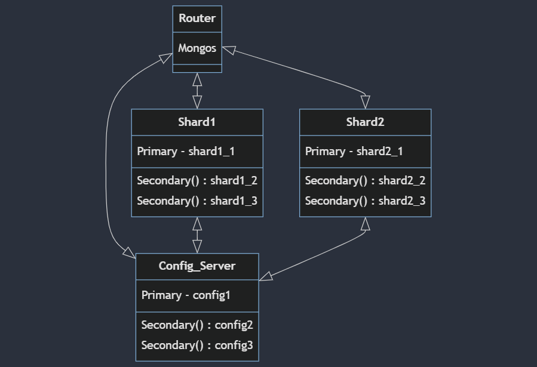

# MongoDB

## Popis technologie

### Obecné chování
**MongoDB** je dokumentová NoSQL databáze. Hlavní rozdíl mezi NoSQL a SQL databází spočívá v datovém modelu.

1. V **SQL** databázích jsou data uspořádána do tabulek s pevnou strukturou, tzv. tabulkové schéma.
2. **NoSQL** databáze používají různé datové modely, jako jsou dokumenty, klíče-hodnoty, sloupce nebo grafy.

Z toho vidíme, že NoSQL databáze lépe pracují s nestrukturovanými daty. Jak bylo zmíněno výše, MongoDB je dokumentová databáze, což znamená, že data jsou uložena ve formě dokumentů. Data uvnitř dokumentu jsou uložena ve dvojicích pole-hodnota, kde hodnoty mohou mít různé datové typy (např. řetězec, celé číslo, pole, atd.).

### Základní principy
* Pro distribuci dat používá BSON (Binary JSON). 
* Podporuje **sharding**, tedy data jsou rozdělena na jednotlivé části a každá tato část je uložena na různých databázových serverech. 
* **Replikace** v MongoDB funguje tak, že data jsou nejprve zapsána do primárního uzlu, a poté jejich kopie jsou uloženy v několika sekundárních uzlech. Každý sekundární uzel může mít vztah pouze k jednomu primárnímu uzlu.
* **Architektura**:
    a. Data jsou uložena ve formě dokumentů.
    b. Podporuje horizontální škálování, což znamená, že data jsou rozložena na více serverů.
    c. Dotazování na dokumenty probíhá na základě jedinečných identifikátorů(můžeme zadat ručně nebo MongoDB ho vygeneruje sám) nebo hodnot polí.
    d. Má flexibilní schéma, což znamená, že ne všechny dokumenty v kolekci musejí mít stejná data(stejné datové typy nebo stejné atributy).

### CAP teorém
MongoDB splňuje garance **CP**. Tedy **konzistence** a **odolnost k přerušení**. 
* **Konzistence** dat je zajištěná tím, že systém MongoDB běží na několika serverech. To znamená, že aktualizace dat se nejprve provádí na hlavním (master) serveru a poté se replikují na všechny servery záložní (slave). 
* **Odolnost k přerušení** je zajištěna tak, že v případě výpadku hlavního serveru se vybere mezi záložními servery ten s nejaktuálnějšími daty a nahradí hlavní server.

### Architektura
Zvolil jsem standardní architekturu. Mám shard cluster se 2 shardy,  1 konfiguračním serverem a 1 routerem. Tato architektura je odolná vůči přerušením, protože každý uzel má nastavený replikační set a sharding zajišťuje rovnoměrné rozložení dat mezi shardy, což zvyšuje rychlost čtení/zápisu a snižuje nároky na paměť na jednom serveru. Celkem používám 10 nodů, protože jak router, tak i shardy s konfiguračním serverem mají jeden primární a dva sekundární bloky. Jak bylo zmíněno výše, mám nastavené replikační sety a v případě výpadku jednoho z primárních nodů bude nahrazen jedním ze sekundárních. Využívám hešovací strategii, která rovnoměrně rozděluje všechna data mezi všechny shardy. Databáze pracuje s dokumenty ve formátu JSON. Dokument je základní prvek databáze. Každý dokument obsahuje ObjectId, který slouží jako primární klíč. Budu pracovat s 1000 dokumentů v klasteru `shopCollection` a s 1000 dokumentu v klasteru `device`. Obě kolekce jsou v databázi `shop`. Data jsem generoval [tady](https://www.mockaroo.com). Vizualizace architektury pomoci [Mermaid](eNqFksFqAyEQhl9F5tRC9rD2tpRe2msgdG9FCLJONtKoYXQLIcm716xuu4G69aLj9zOfyJyhcwqhge4gvX_TsidphGVxvbshILHnS1VdXtirszvdb1ukL6QUaPeSVP1fgC8E7hWpX5FwYRMbn3rf7pwIYxvSRtKJVawbeT2BFuOFiujhMSNeRk8JXee)

### Perzistence
Data na disku jsou uložena ve formátu BSON. Všechna data jsou uspořádána do samostatných složek. Existuje složka nazvaná `data`, která obsahuje podsložky `config`, `router` a `shards`, do kterých se data ukládají. V každé z těchto složek jsem vytvořil vlastní podsložky pro primární a sekundární uzly. Pokud budeme spouštět jednotlivé uzly na různých strojích, data se budou ukládat do stejných složek, ale na různých serverech

### Zabezpečení
V MongoDB je možné šifrovat data pomocí platformy WiredTiger. Data posílaná mezi uzly lze šifrovat pomocí přenosové šifry. Také v MongoDB lze definovat uživatele a jejich role. Role určuje, jaká oprávnění má daný uživatel. Uživatel musí být autorizován před komunikací s databází. Ve své databázi mám nastaveného `userAdminAnyDatabase`, který může vytvářet role. S jeho pomocí jsem vytvořil roli `user`(`db.auth("user", "user")`), která má pouze oprávnění pro čtení a zápis dat do databáze.

### Výhody a nevýhody
* Nevýhody:
    * Malý počet routerů a shardů pro reálné využití pro e-shop. Toto však lze snadno řešit zvětšením počtu již existujících.
    * Generovaná data nejsou dobře propojená mezi sebou.
    * Slabé zabezpečení.

* Výhody:
    * Odolnost vůči přerušením.
    * Rychlé dotazování a rovnoměrné rozložení dat mezi servery díky shardingu.
    * Jednoduché škálování.

### Případy užití
Tuto databázi jsem zvolil pro práci s daty z e-shopu. Zvolil jsem MongoDB, protože je vysoce efektivní a cenově dostupná. Díky flexibilnímu schématu je také vhodná pro data z e-shopu, kde jednotlivé produkty mohou mít různé atributy v rámci jednoho dokumentu. MongoDB je rovněž vhodná pro systémy, které vyžadují rychlý tok dat.  MongoDB je velice flexibilní a škálovatelná, proto je vhodná pro budování cloudových uložišť, která je nutné efektivně prohledávat.

## Popis vlastního datasetu
Mám dva datasety a oba jsou na 1000 dokumentů. První je `main_data.json` ve kterém jsou uložena data uživatelu e-shopu, druhý je `second_cluster.json` ve kterém jsou zakladní charakteristiky zařizení z datasetu `main_data.json`. Dataset `main_data` má celkem 11 atributů, dataset `second_cluster.json` má celkem 7 atributů.
#### main_data.json
* **1.** `user_id`    - id uživatele
* **2.** `first_name` - jmeno uživatele
* **3.** `last_name`  - přijmení uživatele
* **4.** `gender`       - pohlavi uživatele
* **5.** `category`     - typ zařízení
* **6.** `product_name` - název zařízení
* **7.** `price`        - cena zařízení
* **8.** `provider`     - vyrobce
* **9.** `country`      - stát uživatele
* **10.** `rating`      - ohodnocení zařízení uživatelem 
* **11.** `age`         - věk uživatele

#### second_cluster.json
* **1.** `device_id` - id zařízení
* **2.** `product_name` - název zařízení
* **3.** `battery_type` - typ baterie
* **4.** `loudness_dB` - úroveň šumu
* **5.** `bluetooth` - existence bluetooth(true/false)
* **6.** `max_battery_life` - maximální výdrž baterie v hodinách
* **7.** `color` - barva zařízení

## Závěr
Hodně času jsem strávil nad vytvořením vhodné architektury, ale ve výsledku jsem z toho hodně odnesl. Datasety  jsem generoval sám, ale při práci nad dotazy by bylo lepší pracovat s reálnými daty, protože generovaná data ne vždy dostatečně reprezentativní. V mém případě se to projevilo především v komunikaci mezi kolekcemi. Zabezpečení databáze lze také výrazně rozšířit, ale to bude záviset na struktuře e-shopu.

## Zdroje
[Dokumentace k MongoDB](https://www.mongodb.com/docs/manual/)

[Generování dat](https://www.mockaroo.com)

[Hashed Sharding](https://www.mongodb.com/docs/manual/core/hashed-sharding/?_ga=2.115760390.1832541171.1699738926-1857781486.1699369089&_gac=1.128502270.1699742657.CjwKCAiA6byqBhAWEiwAnGCA4I6-wr6XPkLojB23iWuIKARsSRmdxBXN4NYUULS4UctlEILS5yLpvhoCSZoQAvD_BwE)

[Přednáška 2](https://courses.fit.cvut.cz/BI-BIG/prednasky/02/P1_P2.pdf)

[Přednáška 3](https://courses.fit.cvut.cz/BI-BIG/prednasky/03/P3.pdf)

[Přednáška 4](https://courses.fit.cvut.cz/BI-BIG/prednasky/04/P4.pdf)

[Sharding](https://dzone.com/articles/composing-a-sharded-mongodb-on-docker)

[Sharding a MongoDB Collection](https://www.youtube.com/watch?v=Rwg26U0Zs1o&list=PL34sAs7_26wPvZJqUJhjyNtm7UedWR8Ps&index=9)

[Zabezpečení v MongoDB](https://medium.com/mongoaudit/how-to-enable-authentication-on-mongodb-b9e8a924efac)
