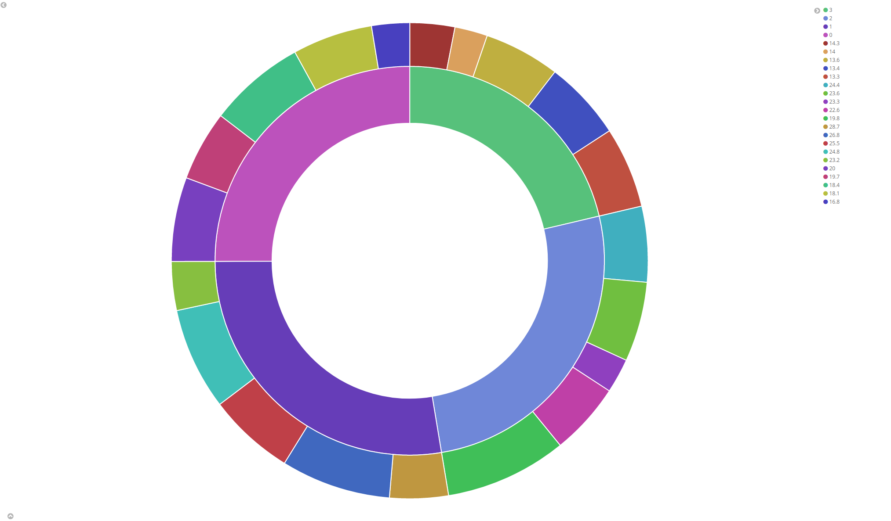
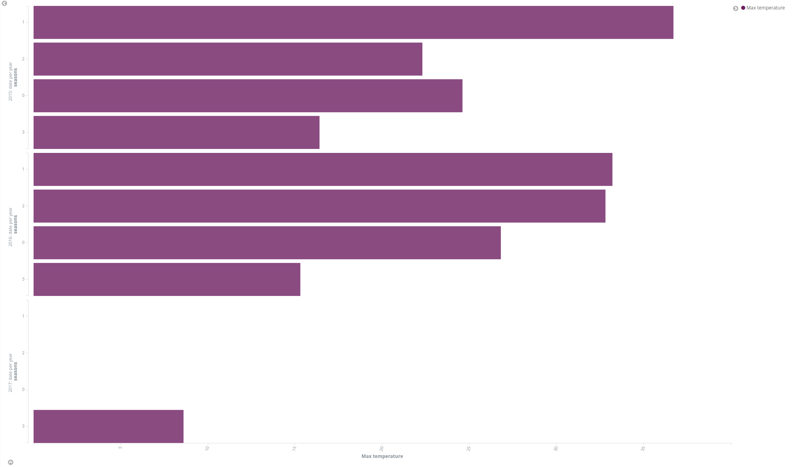
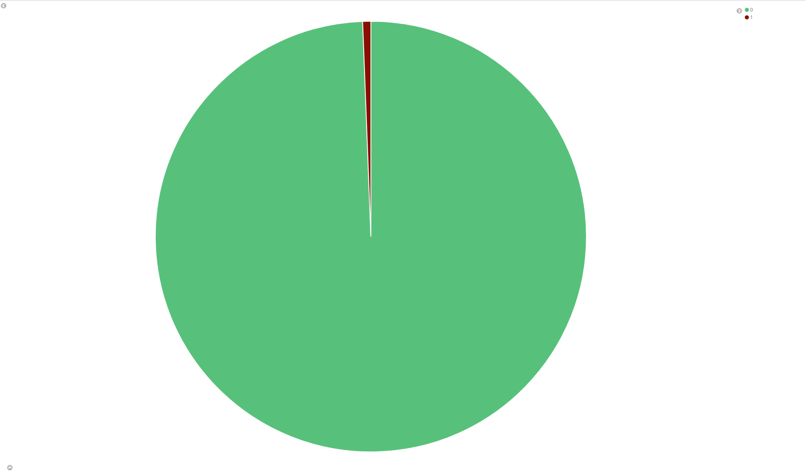
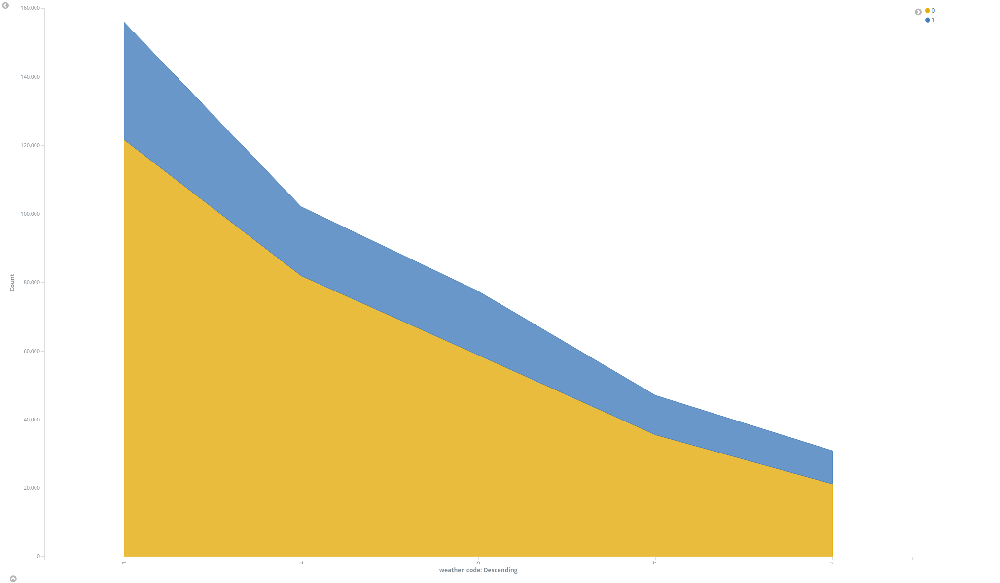
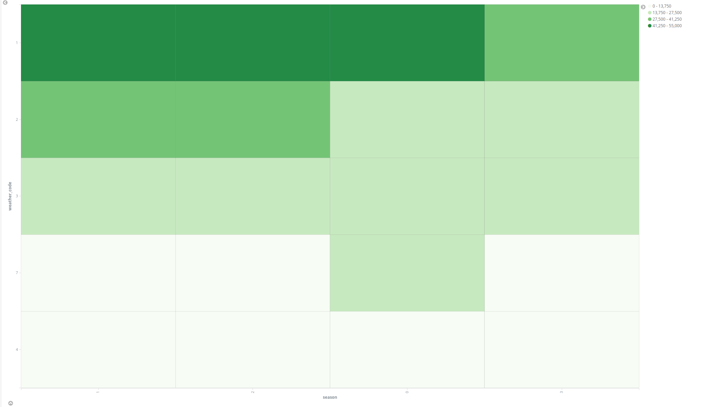
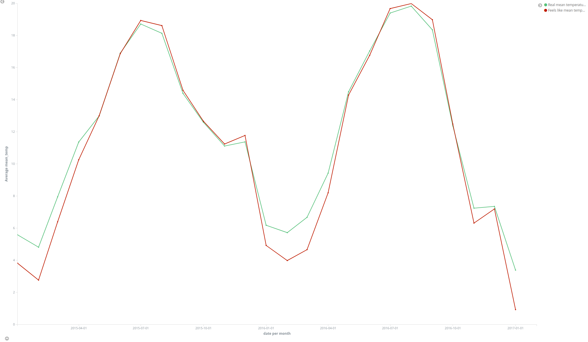
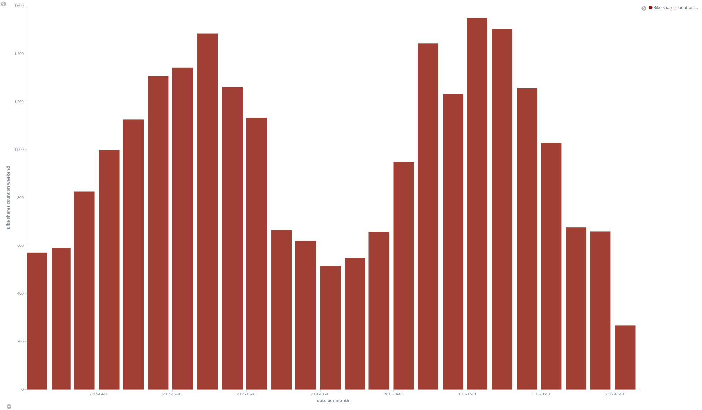
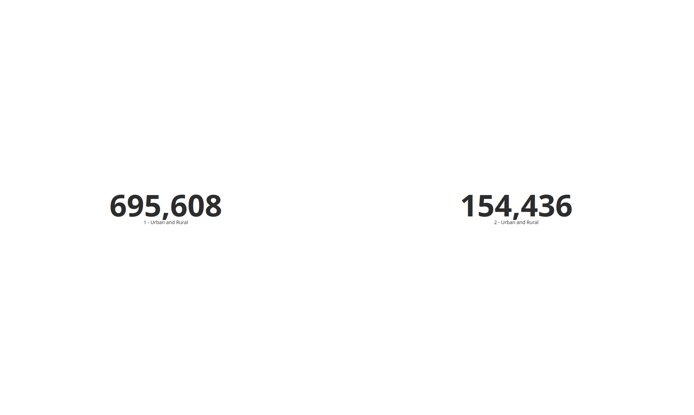

# Vizualizace dat - prezentace výsledků

(obsah viz 2. část, podčást B)

## Vizualizace 1

Graf popisuje rozložení dat podle průměrné teploty a období. Z tohoto grafu můžeme například zjistit, jaké průměrné teploty se vyskytují během jednotlivých období a které období je v datech nejvíce zastoupené. Vidíme, že data jsou rozložena poměrně rovnoměrně. Například z tohoto grafu lze snadno vyčíst, že nejvíce zastoupená teplota v létě je 24 a 26 stupňů.

## Vizualizace 2

Graf popisuje maximální teplotu v jednotlivých letech v průběhu ročních období. Nic překvapivého, obvykle bývá nejvyšší teplota v letním období a nejnižší v zimě. Data pro rok 2017 jsou dostupná pouze pro zimní období, a proto není graf kompletní. Také je patrné, že v létě roku 2015 byla zaznamenána maximální teplota až 36.7 stupňů.

## Vizualizace 3

Jednoduchý graf vizualizuje poměr smrtelných nehod ku nesmrtelným na prázdninách. Z grafu je patrné, že smrtelných nehod je opravdu málo, méně než 1%.

## Vizualizace 4

Graf popisuje počet nehod o víkendu a v pracovní dny v létě a v zimě podle počasí. Z něj je zřejmé, že počet nehod v pracovní dny je mnohem vyšší než o víkendu. Také je patrné, že nejvíce nehod se děje za jasného počasí. Stejně tak je zaznamenáno více nehod za deštivého počasí než za oblačného.

## Vizualizace 5

Tato heatmapa popisuje počet nehod v závislosti na počasí a období během roku 2016. Nejvíce nehod se vyskytuje v létě za jasného počasí, což je docela zřejmé, protože více lidí jezdí na kole, a tedy je i více nehod.

## Vizualizace 6

Tady jsem se pokusil prozkoumat korelaci mezi vnímanou a skutečnou teplotou. Zjistil jsem, že hodnoty mají téměř identické grafy a jsou vysoko korelované, což je správné.

## Vizualizace 7

Tento sloupcový graf popisuje průměrný počet půjčení kol během víkendu v jednotlivých měsících. Graf názorně ukazuje, že počet půjčení kol v zimě klesá, zatímco v létě stoupá. Jde o periodický graf s extrémy v letních a zimních měsících.

## Vizualizace 8

Tento "graf" jsem vytvořil pouze pro ilustraci rozdílu v počtu nehod mezi městskými a venkovskými oblastmi. Je zřejmé, že mnohem více nehod se vyskytuje v městských oblastech. Tento fakt lze vysvětlit buď tím, že máme více dat z městského prostředí, nebo vyšším provozem na silnicích ve městě.

## Vizualizace 9

Tady jsem se pokusil ilustrovat, při jaké maximální teplotě dochází k největšimu počtu nehod. Z obrázku vidíme, že největší počet nehod je při teplotě 16 stupňů, s rozmezím přibližně +/- 3 stupně oproti sousedním hodnotám. Tento fakt se docela dobře koreluje s tím, že počet půjčení kol stoupá v létě. Takže můžeme zavést teorii, že i počet nehod bude růst při zvýšení teploty venku.

