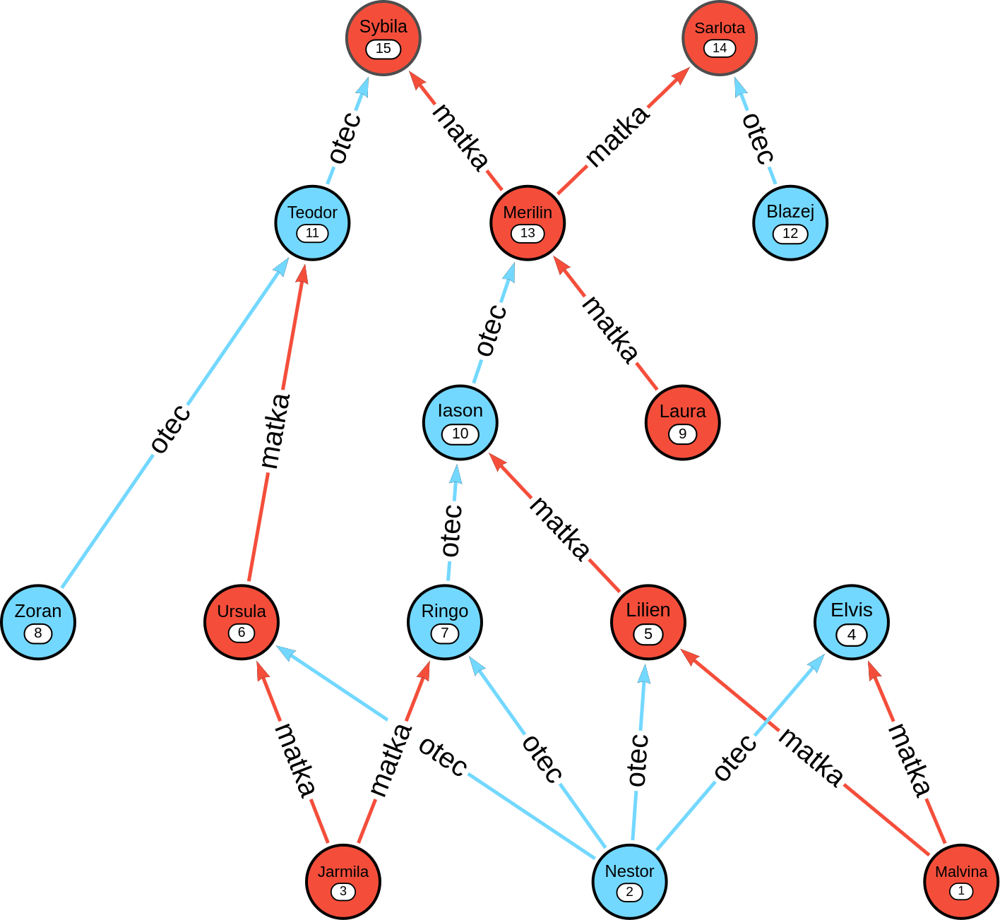

# Rekurze a parametrizovaný kurzor

## Cíle
* vyzkoušet si rekurzivní dotazování
* výsledek "zabalit" do procedury jako parametrizovaný kurzor a otestovat

## Zadání
* v adresáři máte soubor **vydry.sql**, to jsou vstupní data
* tabulka vydry obsahuje rekurzivní data: sloupce matka, otec jsou cizí klíče odkazující zpět do tabulky vyder na cv (číslo vydry)
* navrhněte rekurzivní SQL dotaz, který zobrazí rodovou linii předků dané vydry
* **v první iteraci** si dotaz zjednodušte na mužskou nebo ženskou rodovou linii
    * když se podíváte na přiložený obrazek, tak mužská rodová linie vydry Merilin je: Iason, Ringo a Nestor, její ženská rodová linie je Laura
    * jiný příklady: ženská rodová linie Iasona je Lilien a Malvina, mužska Ringo a Nestor
    * rodovou linii vydry Zoran neznáme (ani mužskou ani ženskou)
* **ve druhé iteraci** zkuste sledovat všechny předky a ve výpisu označte generace (můžete i nějak vhodně odsadit výstup, aby to bylo vizuálně pěkné)
    * například rodová linie vydry Merilin je: Iason(1), Laura(1), Ringo(2), Lilien(2), Jarmila(3), Nestor(3), Malvina(3). Čísla v závorce značí generaci. Jestli v tomto případě bude Nestor ve výpisu 2x, nechám na vás.
* **ve třetí iteraci** odladěný rekurzivní dotaz "zabalte" do procedury coby **kurzor s parametry** a paramterizujte ho číslem vydry a typem linie předků (mužská, ženská, obě)
* procedura dostane jako parametr **jméno vydry** a linii po které se má vydat, proveďte standardní ošetření chybného vstupu a vhodným způsobem vypište výsledek. Procedura bude vracet jména vyder.

## Očekávané výstupy a testování

* soubor [dotazy.sql](dotazy.sql "EMBED|EDIT|LINK|SAVE") ve kterém bude (zejména) dotaz z **druhé iterace** (tedy s výběřeme linie) ve 3 konkrétních variantách (protože v klauzuli WHERE musíte použít konkrétní číslo vydry a linii. Použijte tyto: 
    * 10, mužská
    * 10, ženská
    * 10, obě
* soubor [dotazy.log](dotazy.log "EMBED|EDIT|LINK|SAVE") - zde budou vidět výsledky výše uvedených dotazů; při ladění postačí pracovat s čísly vyder, jména pak dodá až procedura.
* soubor [procedura.sql](procedura.sql "EMBED|EDIT|LINK|SAVE"), kde bude požadovaná procedura s parametrizovaným kurzorem
* soubor [test-procedura.sql](test-procedura.sql "EMBED|EDIT|LINK|SAVE") - použijte následující testovací data: 
    * (Iason, mužská)
    * (Iason, ženská)
    * (Iason, obě) 
    * (Zoran, obě) 
    * (Celestyn, obě)
* poslední dva příklady testují situace, kdy neznáme předky vydry a nebo zadáme neexistující vydru.
* soubor [test-procedura.log](test-procedura.log "EMBED|EDIT|LINK|SAVE") s výsledky

## Přehled rodové linie

* Pro přehlednost vizualizace testovacích dat. 

## bodování a deadline

- max 6 bodů 
- 5.4. 24:00 (pokud by byl problém, domluvíme se 21.3. na výuce)
